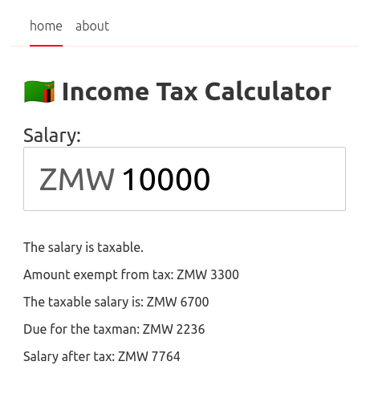

## A personal exercise.

Goal: achieve a reactive Tax calculator for Zambian salaries as a way of experimenting with Svelte.

### Want to try it out?

Checkout repo, run `yarn run dev`. (or use npm...)

*NOTE:* This repo is a learning exercise, it may not be accurate and should not be considered sound financial advice...

### Screenshot

